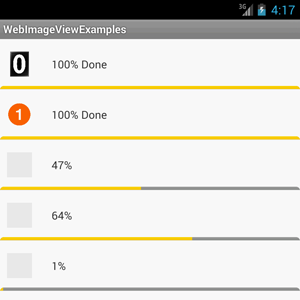

WebImageView
============

Android ImageView which can load image data from an url.

###Features

- **Http/Https** url supported
- Load in **background** and **concurrently**, won't break the main UI thread.
- Build-in **memory/file cache**, access network as few as possible.
- **Progress update** supported, very easy to implement progress bar or something similar.
- **Placeholder** image supported.
- Works perfectly with **ListView** .

###How to use?

####Add WebImageView as a Library.

Eclipse for example:

- Import this project. 
- Make WebImageView a Library project: right click the WebImageView project name, select **Android** in the left properties list, and on the right panel, check **Is Library**
- Add it to other projects: still right click the project name which needs WebImageView, find the Android property panel, and this time, click the Add button in the Library part, which will show a project list, just select the WebImageView project.

Or copy **webimageview.jar** in the WebImageView's **bin** folder, to the **libs** folder of projects where needs WebImageView.

#### In Xml layout

	<?xml version="1.0" encoding="utf-8"?>
	<LinearLayout xmlns:android="http://schemas.android.com/apk/res/android"
	    xmlns:app="http://schemas.android.com/apk/res-auto"
	    android:layout_width="fill_parent"
	    android:layout_height="fill_parent"
	    android:orientation="vertical" >
	
	    <com.rsv.widget.WebImageView
	        android:layout_width="fill_parent"
	        android:layout_height="80dp"
	        app:webImageUrl="[the image url]" />
	
	</LinearLayout>

The key parts are:

-  xmlns:app="http://schemas.android.com/apk/res-auto"
-  <com.rsv.widget.WebImageView
-  app:webImageUrl="[the image url]" 

The others are just normal ImageView stuff.

You might got an error like this:
 
> No resource identifier found for attribute 'webImageUrl' in package 'com.rsv.widget'

Just add attr.xml in the res/values folder, and fill in such content:

	<?xml version="1.0" encoding="utf-8"?>
	<resources>
	
	    <declare-styleable name="WebImageView">
	        <attr name="webImageUrl" format="string" />
	    </declare-styleable>
	
	</resources>

#### In Java program

	WebImageView webImage = (WebImageView) this.findViewById(R.id.webImage);

With a WebImageView instance, you can:

- Set the image url

		webImage.setWebImageUrl(url);

- Set the placeholder

		webImage.setWebImagePlaceholder(Drawable/Bitmap/resouceId)

- Set the progress listener

		webImage.setWebImageProgressListener(new WebImageProgressListener() {
	
				@Override
				public void onStart(WebImageView view) {
					//start loading image
				}
	
				@Override
				public void onLoading(WebImageView view, int progress) {
					//loading progess(0~100) 
				}
	
				@Override
				public void onLoad(WebImageView view) {
					//Finish loading
				}
	
				@Override
				public void onError(WebImageView view, Exception e) {
					//Something wrong
				}
			});

###Configuration

There're some parameters which can be configured in the properties file.

Create a file named **com.rsv.webimageview.config.properties** in the **assets** folder.

	#the cache directory name, default: rsv_webimg_cache
	webImageCacheDir=rsv_webimg_cache
	
	#storage location
	#	1: external(default)
	#	2: for interval
	webImageCacheStorage=1
	
	#the cache space limit in MB, default 50
	webImageCacheSpaceInMB=50
	
	#how many web images could be kept in memory as cache
	#we use SoftReference to cache the image, if memory is too low, the space will be recycled anyway, so do not worry too much.
	webImageMemorySizeLimit=30

	#the useragent to fetch the image url
	useragentForImageLoader=Mozilla/5.0 (compatible; RsvWebImageView)	

###FAQ

- How long will an image be expired?
	
	The answer is **Never** for right now. I think accessing network should be as few as possible, so images will be cached in the **webImageCacheDir** and only be removed when the space occupied in MB exceeds  the value of **webImageCacheSpaceInMB**. 

	But if an image does expire very often, you chould handle it like this:

	Append some **get** parameter to the end of the image url, which make it looks like another image. For example:

		http://www.android.com/images/logo.png

	And
	
		http://www.android.com/images/logo.png?t=timestamp

	are the same image, but will be treated as different web images as with differtnt urls .

- Image size and ImageView size.

	WebImageView extends ImageView, and it only cares how to load to url efficiently, and let the ImageView to handle the scale problem.

	For example, the real image might be 300px * 300px, but the ImageView size might just be 100px * 100px. WebImageView's cache system does cache the 300 * 300 image, but it's still to be scaled in time when displayed, which consumes the cpu. So for performance reasons, it's recommended to make the image size just fit in the ImageView.

